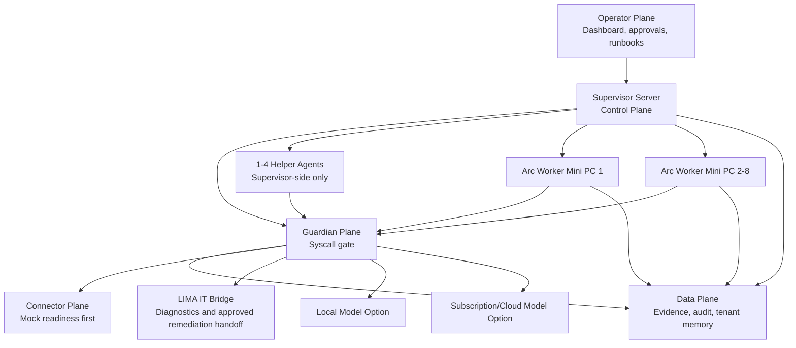

# LIMA Office OS Architecture

## System Overview

LIMA Office OS is a governed small-business office control plane. The first viable target is one customer/tenant with one Supervisor Server, 1-8 Arc worker mini PCs, optional 1-4 supervisor-side helper agents, Guardian gates, and future LIMA IT handoff.

Phase 0 defines the contracts and trust boundaries. The approved lab slice now
implements one non-executing operating path: authenticated Arc registration and
heartbeat, mandatory Guardian, LIMA governed decision, durable SQLite evidence,
and an Arc assignment acknowledgement. It grants no execution authority and is
not production-ready.

The first transport is short-lived HMAC-authenticated metadata over an explicit
foreground, loopback-only Arc endpoint and an explicit foreground,
loopback-only Supervisor endpoint. The Arc `arc-preflight` client authenticates
one operator and submits a structured request without supplying actor role or
action classification; the Supervisor binds identity and derives
classification server-side. Channel keys are injected over stdin, never stored
in evidence, and represented only by opaque key IDs. Replay identities, worker
health snapshots, and control-plane evidence persist in SQLite. Private-LAN
deployment remains blocked on a reviewed confidentiality and device/operator
key provisioning design.

## Architecture Planes

### Control Plane

The Supervisor Server coordinates tasks, worker registration, task routing, policy checks, approval requests, health status, evidence references, and operator reporting.

### Worker Plane

Arc worker mini PCs execute bounded office roles. Workers register with the supervisor, declare capabilities, receive scoped assignments, send heartbeat, return status/results, and support quarantine/revoke.

### Guardian Plane

Guardian is the syscall gate for model calls, tool calls, file mutations, network actions, outbound messages, connector actions, scheduled work, and privileged operations. Guardian classifies risk, enforces approval requirements, denies blocked actions, and emits evidence.

### Data Plane

The data plane stores task metadata, tenant-scoped memory references, worker status, approval records, and evidence artifacts. It must support redaction, retention, export, delete, and customer exit posture before runtime use.

### Connector Plane

Connectors are mock/readiness-only in Phase 0. Future connector access must declare read/write/admin scope, consent, secret reference, risk tier, approval needs, and revocation behavior.

### Operator Plane

The operator plane provides status, approvals, warnings, quarantine controls, evidence views, and runbook guidance. It must not hide background work or imply an action happened without visible evidence.

## Supervisor Server

The Supervisor Server owns:

- Orchestration and task routing.
- Worker registry and health state.
- Guardian policy integration.
- Approval workflow.
- Model routing policy.
- Evidence and audit ledger references.
- Tenant memory boundary.
- Helper-agent scope.
- Operator dashboard.
- LIMA IT handoff posture.

## Arc Worker Mini PCs

Arc workers own bounded execution for assigned office roles. Each worker must have:

- Worker identity.
- Capability manifest.
- Role and tool-pack scope.
- Heartbeat and health state.
- Task inbox/outbox.
- Local encrypted cache.
- Evidence capture.
- Quarantine and revoke behavior.
- Update and rollback posture.

## Helper Agents

The Supervisor Server may use 1-4 helper agents for memory review, file work, background review, or LIMA IT assistance. Helper agents are not independent workers. They must be scoped, visible, logged, and Guardian-gated. They must not receive direct unrestricted connector, network, file, or tool access.

## Local And Cloud Model Routing

Workers may use a preloaded local model or a subscription/cloud model depending on task class, data classification, model capability, cost posture, and policy. Model routing must be Guardian-gated and evidence-producing.

Minimum routing fields:

- `tenant_id`
- `task_id`
- `worker_id`
- `model_route`
- `data_classification`
- `allowed_provider_class`
- `approval_required`
- `guardian_decision_id`
- `evidence_artifact_id`

## Mermaid Architecture Diagram

## Trust Boundaries

- Operator to Supervisor: authenticated operator session and role.
- Supervisor to Worker: authenticated device identity, capability lease, heartbeat, and revocation.
- Guardian to Tool/Connector/Model: explicit decision envelope before action.
- Worker to Local Cache: encrypted cache and tenant-bound data.
- LIMA Office to LIMA IT: diagnostic and remediation handoff only until approved.
- Tenant to Tenant: no shared memory, evidence, approvals, or connector state.

## Non-Goals For Phase 0

- Live connectors.
- Production server control.
- Hidden background work.
- Autonomous external sends.
- Autonomous financial or employment decisions.
- Runtime implementation beyond explicitly approved scaffolding.
