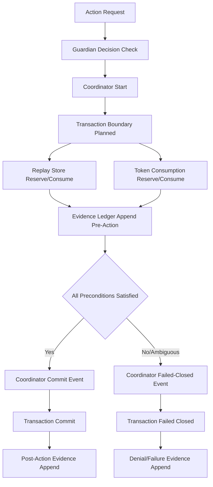
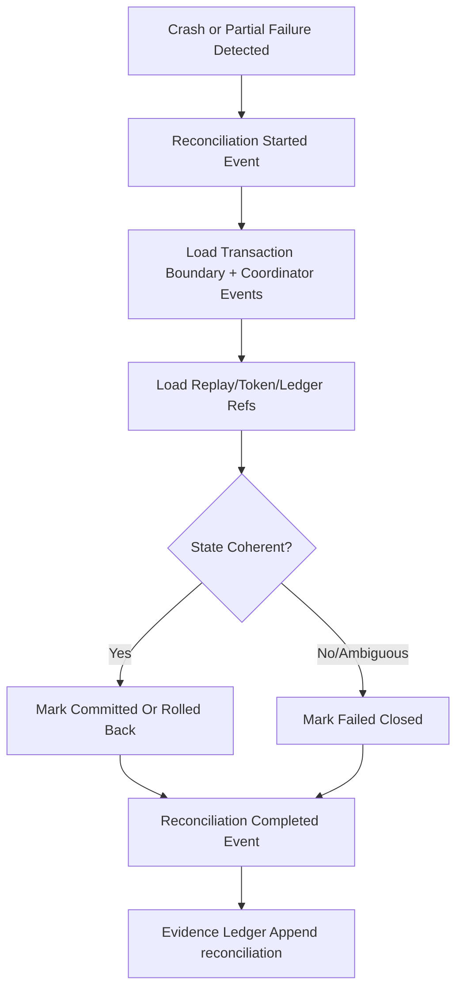
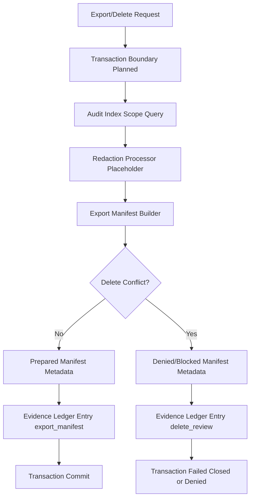

# Durable Storage Architecture (Conceptual)

Status: draft conceptual architecture. Not implemented.

This document defines a future storage architecture for durable replay/token
consumption and evidence export posture. It does not select a concrete storage
engine and does not implement databases, queues, services, or migrations.
Coordinator transition design is defined in
[DURABLE_TRANSACTION_COORDINATOR](DURABLE_TRANSACTION_COORDINATOR.md).

## Purpose

Provide an architecture-level model for future durable transaction and evidence
storage behavior that remains consistent with Guardian-first, fail-closed, and
MVP-boundary constraints.

## Conceptual Components

- Transaction Coordinator
- Replay Store
- Token Consumption Store
- Evidence Ledger
- Evidence Blob Store placeholder
- Export Manifest Builder
- Redaction Processor placeholder
- Audit Index
- Taxonomy Registry placeholder (reason-code sets for reconciliation/evidence/
  export-delete conflict metadata)

## Component Responsibilities

- Transaction Coordinator: enforces transition ordering, tenant-scoped
  idempotency, and terminal fail-closed status for replay/token/evidence flows.
- Replay Store: durable nonce reserve/consume/deny/fail-closed metadata.
- Token Consumption Store: durable one-time approval-token consume metadata.
- Evidence Ledger: append-only, hash-linked metadata entries.
- Evidence Blob Store placeholder: protected payload-ref target (not defined in
  this pass).
- Export Manifest Builder: refs-only manifest generation.
- Redaction Processor placeholder: applies policy-driven exclusions/redactions.
- Audit Index: query support for operator/security/compliance review.
- Taxonomy Registry placeholder: versioned reason-code dictionaries used by
  coordinator/replay/evidence/governance records.

## Data Flow: Consume Path

## Data Flow: Recovery/Reconciliation

## Data Flow: Export/Delete Review Path

## Trust Boundaries

- Supervisor transaction coordination boundary.
- Guardian and approval policy decision boundary.
- Ledger append boundary.
- Export/delete governance boundary.
- Tenant/customer-context isolation boundary.

Each boundary must preserve explicit evidence linkage and fail closed on
ambiguity.

## Storage Boundary Rules

- No cross-tenant data in transactional records.
- No raw customer content in transaction/ledger/export contracts.
- No secret material in contract metadata.
- Durable records are append-oriented; mutation is represented via new entries.
- Cross-contract linkage refs and `linkage_status` fields must remain coherent;
  drift or missing refs are fail-closed outcomes.

## No Implementation Selection Yet

This pass intentionally does not select:

- specific SQL/NoSQL engine
- object-storage provider
- queue technology
- lock manager
- migration framework

Selection requires a dedicated implementation RFC with threat model and failure
testing plan.

## Possible Future Storage Classes

- Local SQLite lab store (single-node lab durability).
- Server PostgreSQL store (multi-process concurrency control).
- Append-only object store (artifact/index separation).
- WORM-style evidence archive placeholder (immutability-focused retention
  posture).

## Tradeoffs

- SQLite: simple and local, weaker multi-writer coordination posture.
- PostgreSQL: stronger transactional semantics, higher operational complexity.
- Append-only object store: good archive durability, requires index consistency
  and chain-verification design.
- WORM-style archive: strong tamper-resistance goals, operational and cost
  complexity.

## Why No Storage Is Implemented In This Pass

- Phase objective is architecture/contracts/tests only.
- Final trust-root, RBAC/IdP/MFA, retention, and redaction rules are unresolved.
- Safe engine selection depends on final transaction and recovery requirements.
- Introducing real storage now would violate MVP scope and runtime boundaries.

## MVP Non-Goals

- No real transaction coordinator runtime.
- No storage-engine implementation.
- No migration files or migration runner.
- No queue/scheduler/service process.
- No export/delete execution pipeline.
- No live connector/external-send/remediation action path.

## MVP Blocked Items

- actual transaction coordinator implementation
- durable storage engine choice
- migrations
- real atomic commit mechanism
- evidence blob storage
- final retention periods
- redaction taxonomy
- final export package format
- customer delete proof
- RBAC/IdP/MFA/session/device trust
- attestation trust root
- signed update/rollback details
- live connector criteria

## Deferred Implementation Gates

- Approved transaction coordinator design.
- Approved replay/token atomicity mechanism.
- Approved evidence blob strategy.
- Approved export package format.
- Approved delete-proof posture.
- Approved operational runbooks for backup/restore/recovery/rollback.
