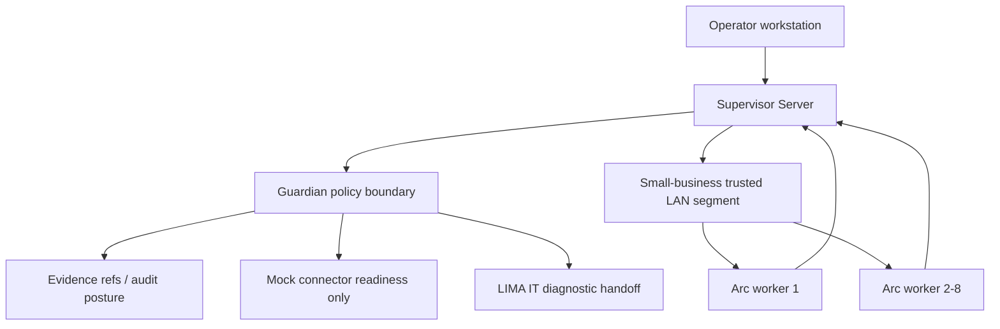

# Network Blueprint

## Purpose

Define the logical network posture for a small-business LIMA Office OS lab or
planned local deployment. This is a planning document only and does not
configure firewalls, VPNs, routers, DNS, workers, or production systems.

## Logical Layout

## Supervisor-To-Worker Communication

- Workers should initiate or maintain authenticated channels to the Supervisor
  Server.
- The future authenticated channel should use mTLS or equivalent device identity.
- Supervisor endpoint refs must be stable and inventory-backed.
- Supervisor owns task assignment, policy refs, quarantine, revoke, and evidence
  posture.
- No worker may accept a task without a Guardian decision ref.

## Worker-To-Supervisor Heartbeat

Heartbeat records should include:

- Worker ID.
- Tenant/customer context.
- Heartbeat sequence.
- Worker lifecycle and health state.
- Evidence writer status.
- Policy bundle and capability manifest refs.
- Update and rollback state.
- Network reachability and clock skew.

Default lab planning interval is 60 seconds. Missed-heartbeat thresholds remain
policy-controlled and must be visible in operator status.

## No Inbound Public Worker Exposure

Workers must not expose public inbound services in MVP. Any remote access used
for field support is out of scope until identity, approval, evidence, and
operator visibility are defined.

## Firewall Assumptions

Minimum firewall posture:

- Allow worker-to-supervisor heartbeat and approved local control traffic.
- Deny public inbound connections to workers.
- Deny worker-to-worker trust paths by default.
- Deny connector, production-system, and remediation traffic unless a future
  Guardian policy explicitly allows a mock/read-only path.
- Deny broad outbound internet access from workers unless future policy approves
  a narrow, evidenced path.

Exact ports are not assigned in this blueprint because no worker service or
daemon is implemented. Future port choices must be documented as policy-bound,
least-privilege, and evidenced.

## DNS And Hostname Naming

Recommended naming convention:

- Supervisor: `lima-sup-<site>-01`.
- Worker: `arc-<role>-<site>-NN`.
- Hostnames should match inventory records and deployment contract refs.
- Hostname changes require evidence and operator review.

## Time Sync

- Supervisor and workers need a documented time source ref.
- Clock skew must be visible in heartbeat posture.
- Excessive clock skew should degrade or quarantine a worker until reviewed.
- Time sync configuration is a field checklist item, not an automated action in
  this blueprint.

## Segmentation Recommendations

- Place Supervisor Server and workers on a controlled business-owned segment.
- Separate worker traffic from guest Wi-Fi and unmanaged devices.
- Prefer wired Ethernet for workers that need stable heartbeat.
- Do not place workers directly on production server management networks.
- Do not grant workers direct access to payment, HR, legal, medical, or
  regulated systems.

## Local-Only Versus Hybrid

Local-only:

- Supervisor and workers stay on the local trusted segment.
- No external model calls or live connector calls.
- Mock connector readiness only.

Hybrid planned:

- External egress must be Guardian-gated, policy-bound, evidence-producing, and
  data-classification aware.
- Subscription/cloud model use remains blocked until model-routing defaults,
  provider class, redaction, and approval posture are resolved.

## No Direct Cross-Worker Trust

Workers must not trust each other directly. Coordination flows through the
Supervisor Server and Guardian decisions. A compromised worker must not grant
capability, policy, model, cache, connector, or file access to another worker.

## No Direct Production-System Remediation

Workers do not perform production remediation in MVP. LIMA IT handoff is
diagnostic/read-only unless future contracts, approvals, evidence, and operator
controls explicitly authorize more.
